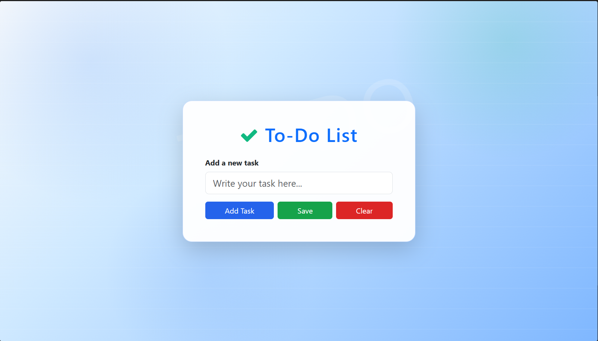

# To-Do List Task

A simple browser-based to-do list app built with HTML, CSS, and JavaScript.

## Features

- Add new tasks using the input field.
- Mark tasks as completed and move them to a completed list.
- Undo completed tasks back to active tasks.
- Delete individual tasks.
- Save tasks locally in `localStorage`.
- Clear all tasks with confirmation.
- Responsive UI styled with Bootstrap and custom CSS.

## Files

- `index.html` - app structure and layout.
- `style.css` - custom styling, background, card design, buttons.
- `script.js` - task creation, display, completion, delete, save, clear, and localStorage handling.

## Usage

1. Open `index.html` in your browser.
2. Type a task into the input field.
3. Click `Add Task` or press Enter to add it.
4. Use `Complete` to mark a task done, or `Undo` to restore it.
5. Click `Save` to persist tasks in browser local storage.
6. Click `Clear` to remove all tasks.

## Local Storage

- Tasks are loaded from `localStorage` when the page loads.
- Saving writes the current task list to `localStorage`.
- Clearing removes saved tasks from `localStorage`.

## Notes

- The app uses Bootstrap 5 and Font Awesome via CDN.
- The UI supports a clean, centered card layout with animated background details.
- Task IDs are generated using a timestamp plus random string.

#Preview

